```mermaid
gantt
    title 2021~2022 学期活动
    dateFormat  YYYY-MM-DD
    section 学期
    上学期                                         :2022-08-23, 2023-01-16
    寒假                                           :2023-01-17, 2023-02-25
    下学期                                         :2023-02-18, 2023-06-30
    暑假                                           :2023-06-25, 2023-08-15
    小学期                                         :2023-07-03, 2023-07-20
    section 辩论
    辩论队招新推送                                  :2022-08-30 10:51, 1d
    辩论队辩手介绍                                  :2022-09-01 17:37, 1d
    一培通知                                       :2022-09-06 18:28, 1d
    一培                                          :crit, 2022-09-08, 1d
    院新生赛                                       :crit, 2022-09-18, 2022-10-23
    院队报名推送                                   :2022-09-28, 1d
    院队报名                                       :crit, 2022-09-28, 2022-10-09
    院队面试                                       :crit, 2022-10-16, 1d
    二培                                           :crit, 2022-10-31, 1d
    校队报名                                       :2023-01-25, 2023-01-26
    校队一面                                       :2023-01-28, 2d
    校队二面                                       :2023-02-05, 1d
    交大论坛                                       :2023-04-15, 2023-06-11
    换届面试                                       :2023-06-07, 1d
```

测试用

# First level heading

## Second level heading

### Third level heading

## Hello!

| test | table |
|------|-------|
|waibiwaibi|waibibabo|

$$
1+1=?
$$

**Bold**, *Italic*, <s>Delete</s>, <u>Underline</u>

---

------

测试下评论
抄自 [Welcome to giscus! · Discussion #62 · giscus/giscus](https://github.com/giscus/giscus/discussions/62#discussioncomment-740574)
以及 [github-flavored-markdown-test/README.md at master · suan/github-flavored-markdown-test](https://github.com/suan/github-flavored-markdown-test/blob/master/README.md)

Hello! 🎉

**Test markdown features...**

# H1
followed by some text

## H2
followed by some text

### H3
followed by some text

#### H4
followed by some text

##### H5
followed by some text

###### H6
followed by some text

Auto-detected link: https://giscus.vercel.app

Can render `inline code`, *italics*, **strong**, 😄

> here is blockquote
> test `inline code`, *italics*, **strong**, 😄

When $a \neq 0$, there are two solutions to $(ax^2 + bx + c = 0)$ and they are

$$
x = \frac{-b \pm \sqrt{b^2 - 4ac}}{2a}
$$


**The Cauchy-Schwarz Inequality**

$$
\left(\sum_{k=1}^n a_k b_k\right)^2 \leq \left(\sum_{k=1}^n a_k^2\right)\left(\sum_{k=1}^n b_k^2\right)
$$


Lorem ipsum dolor sit amet, consectetur adipiscing elit. Duis id sem purus, eu commodo tortor. Donec malesuada ultricies dolor a eleifend. In hac habitasse platea dictumst. Vivamus a faucibus ligula. Nullam molestie tristique arcu, eu elementum metus ultricies sed. Aenean luctus congue lectus, vitae semper erat rhoncus non. Nulla facilisi.

Horizontal rule:

---

|Table Header 1|Table Header 2|
|----|----|
|Content|	https://github.com/laymonage/giscus|
|Content|	http://github.com:\<test>|
Text right below table. Follows is a table with an empty cell, and unaligned indenting.

|Table Header 1	| Table Header 2|
|---|---|
|Content|	Content|
|Content| |


    def this_is
      puts "some #{4-space-indent} code"
    end

<code>
def this_is
  puts "some #{code tag} code"
end
</code>

<pre>
def this_is
  puts "some #{pre tag} code"
end
</pre>

```
def this_is
    puts "some #{fenced} code"
end
```

```ruby
class Classy
  def this_is
    puts "some #{colored} ruby code with ruby syntax highlighting"
    @someobj.do_it(1, 2)
  end
end
```

```javascript
var test = function this_is(){
  console.log("some" + colored + "javascript code with javascript syntax highlighting really long");
}
```

```clojure
(defproject myproject "0.5.0-SNAPSHOT"
  :description "Some clojure code with syntax highlighting."
  :dependencies [[org.clojure/clojure "1.5.1"]]
  :plugins [[lein-tar "3.2.0"]])
```

```js
var test = function this_is(){
  console.log("language declared as 'js' instead");
}
```

```bogus_language
var test = function this_is(){
  console.log("language declared as bogus_language");
}
```

```diff
- print('hello world')
+ print('Hello, world!')
```

