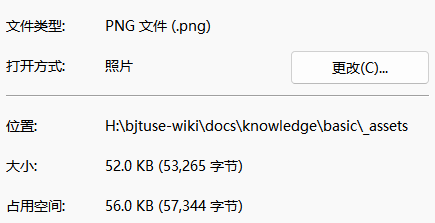
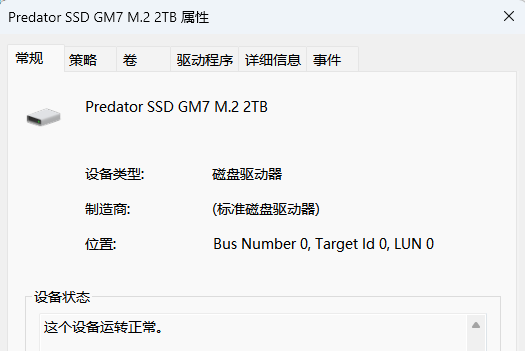
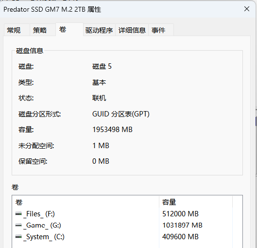
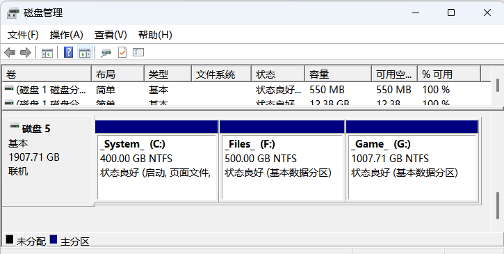

# 比特、字节

## 比特、字节

计算机中的一切数据均以二进制形式（一堆 0 和 1）存储，换句话说，任何数据存储介质（U盘、硬盘、光盘、软盘）本质上都是在用各式各样的方式去完成这个“存储 0 和 1”的任务。

数据的最小单位是 **比特（bit）**，也就是一个 0 或者一个 1，8 个比特为 1 **字节（Byte）**。

{ width="400" }
{ width="400" }

有时候也将 Byte 简写为 B，即我们平常所见到的 KB、MB、GB 等单位中的“B”。

B 到 KB，KB 到 MB，MB 到 GB，后面依此类推，他们之间的进率是 1024，有时也用 1000，这是个历史遗留问题。

于是后来出现了 KiB，MiB，GiB 等中间带个“i”的单位，他们之间的进率就是标准的 1024。

简单整理一下：

```
1 bit 即一个 0 或 1，我们有时候也称其为“一位”数据。

8 bit = 1 Byte

B -> KB -> MB -> GB -> ...
换算关系为 1024 B = 1 KB，有时也用 1000 B = 1KB，后续依此类推

B -> KiB -> MiB -> GiB -> ...
换算关系为 1024 B = 1 KiB，后续依此类推
```

## 例子

### Windows 中的 KB 等单位是 1000 还是 1024？

比如有这样一张图片，从文件资源管理器查看它，显示的大小是 52.0KB：

{ width="400" }
{ width="400" }

如果我们进到这个文件的属性页面，就可以看到更详细的字节数：

{ width="400" }

$$
\begin{array}{l}
\dfrac{53265}{1024} \approx 52.02\\
\\
\dfrac{53265}{1000} = 53.265
\end{array}
$$

那么微软的 Windows 中的 KB 等单位看来是以 1024 计算的。

### 为什么我买的硬盘大小和实际大小不一致？

比如我有这么一块硬盘，买的时候标的是 2TB 大小：

{ width="400" }

但是他的实际大小其实是 1953498MB 或者 1907.71GB：

{ width="34%" }{ width="65%" }

确实：

$$
\dfrac{1953498}{1024} \approx 1907.71
$$

但是，2TB 难道不应该是 2048GB 么？别急：

$$
\begin{array}{rl}
  &1953498\text{MiB} = 2000381952\text{KiB} = 2048391118848\text{B}\\
= &2048391118.848\text{KB} = 2048391.118848\text{MB} = 2048.391118848\text{GB}\\
= &2.048391118848\text{TB} \approx 2\text{TB}
\end{array}
$$

没错，厂商是按 1000 算的。