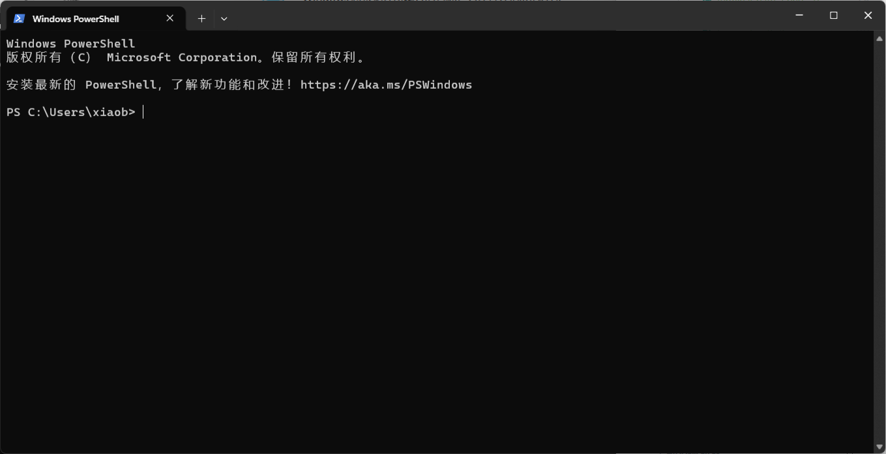

## 引入

按下 ++win+r++，你会看到出现了这样一个小窗口：

<figure markdown="span">
    { width=70% }
</figure>

在里面输入 `cmd` 后点击确定（或者直接按回车），会出来这样一个窗口：


你还可以输入 `powershell`，会出来一个很像的这样的窗口（如果你用的是 Windows 8 及以上）：



而如果你看一看任务栏，你会发现他们两个其实是一个程序 —— **终端（Windows Terminal）**（如果你用的是 Windows 10 及以上）：

<figure markdown="span">
    { width=80% }
</figure>

`cmd` 是什么？`powershell` 是什么？终端又是什么？为什么 `cmd` 和 `powershell` 打开的都是“终端”这个程序？

下面听我娓娓道来。

## Shell

首先，`cmd` 和 `powershell` 是类似的存在，`cmd` 更老一些，如今已经被 `powershell` 取代（所以如果你在开始菜单找到终端直接打开，你会发现里面是 `powershell` 而不是 `cmd`）。

而他们，被统称为 **Shell** —— 一个接受输入的命令，执行对应操作的程序。下面就以 `powershell` 为例子来讲。

比如，你在里面敲下 `ls` 然后按回车（如果是 `cmd` 的话要输 `dir`），你会发现它输出了一堆文件列表：


## 终端（Terminal）

!!! info
    虽然 Windows 上的这个程序名为终端，但终端并不特指这一程序。

    因此，下面为了避免混淆，统一以 “Windows Terminal” 称呼 Windows 上的这个特定的终端软件。

广义上来说，**终端（Terminal）** 的含义就是计算机的一种输入、输出设备。比如这是一个很早期的的终端设备 ASR-33[^1]：

<figure markdown>
  { width=80% }
  <figcaption markdown>
  ASR-33 电传打字机 (1)
  { .annotate }
  
  1. By Marcin Wichary, <a href="//commons.wikimedia.org/wiki/User:AlanM1" title="User:AlanM1">User:AlanM1</a> - Derived (cropped) from <span class="mw-default-size" typeof="mw:File"><a href="//commons.wikimedia.org/wiki/File:ASR-33_2.jpg" class="mw-file-description"></a></span>, <a href="https://creativecommons.org/licenses/by/2.0" title="Creative Commons Attribution 2.0">CC BY 2.0</a>, <a href="https://commons.wikimedia.org/w/index.php?curid=20744606">Link</a>
  </figcaption>
</figure>

它就是那个年代的这个“黑色的小窗口”，用户通过键盘输入命令，而计算机将输出的结果打印在纸上（运作过程可以看看这个视频：[Playing Adventure on an ASR33 Teletype - YouTube](https://www.youtube.com/watch?v=Qs4-5aWBg4M)）

所以简单来说，可以接受用户输入，呈现计算机输出的东西就是一个终端。

前面说了 **Shell** 是接受输入的命令并执行对应的操作的程序，那么 **终端** 则是 **Shell** 获取输入、展示输出的一个渠道。


## 路径（Path）与 Shell 基本命令

!!! info
    此处介绍的命令基本上是较为通用的绝大多数 Shell 和操作系统都支持的命令（虽然实际逻辑可能有差异，但是功能差不多），简易熟练掌握（其实用多了就熟了，也不用刻意去背）。
    
    此外，这些命令可能对于 `cmd` 来说并不适用，需要使用 `powershell`。

### 路径、路径分隔符、`pwd` 命令

前面应该注意到了，在 Shell 输入命令位置的前面有一段 **提示符（Prompt）**：

<figure markdown>
  { widht=400 }
</figure>

最左侧的 `PS` 表示当前的 Shell 是 PowerShell，中间是目前所处的路径，最后 `>` 的右侧就是我们输入命令的地方。

**路径（Path）** 即形如 `H:\bjtuse-wiki\README.md` 的东西，它表示的是一个文件或一个目录（文件夹）在计算机文件系统中的位置。

我们知道文件系统是一个树状结构，存在着十分鲜明的层级结构，对应到路径中也就是一个个的 `\`，这个符号叫做 **路径分隔符**，在 Windows 上它是 `\`，而在 Linux/MacOS 上它是 `/`。

可以在资源管理器的地址栏看到当前所处的路径：


在 Shell 中，除了查看提示符中展示的路径外，还可以用 `pwd` （Print Working Directory）命令显示当先所处的目录：

```terminal
PS C:\Users\xiaob> pwd

Path
----
C:\Users\xiaob
```

### 绝对路径、相对路径、`cd`、`cat` 命令

绝对路径以盘符（根目录）开始一路到具体的文件或目录结束，相对路径不以盘符（根目录）开始，同样到具体的文件或目录结束。

绝对路径很好理解，那相对路径该如何表示？

```
bjtuse-wiki
├─docs
│  ├─intro
│  └─knowledge
├─justfile
└─README.md
```

对于上面的目录结构，如果我们当前所处的位置是 `bjtuse-wiki`，如何用相对路径访问到各个文件？

很简单：

- `README.md` / `justfile` / `docs`：直接就是 `README.md` / `justfile` / `docs`
- `intro` / `knowledge`：则是 `docs/intro` / `docs/knowledge`

有时候会在相对路径的前面加上 `./` 来表示“当前目录”。

所以 `bjtuse-wiki` 相对于自己的路径也就是 `./`。

使用 `cd`（Change Directory） 命令可以切换目录：

```
PS H:\bjtuse-wiki> cd docs
PS H:\bjtuse-wiki\docs> pwd

Path
----
H:\bjtuse-wiki\docs
```

那么现在问题来了，我要如何访问到上级目录下的 `README.md` 呢？

也很简单，除了 `./` 这个特殊的路径外，还有一个 `../` 表示“上级目录”，那么相对于 `docs` 就有如下相对路径：

- `docs`：`./`
- `intro` / `knowledge`：直接是 `./intro` / `./knowledge`
- `README.md` / `justfile`：则为 `../README.md` / `../justfile` / `../docs`
- `bjtuse-wiki`：也就是 `../`

这里再介绍一个命令 `cat`，可以简单理解其功能是显示一个文件的内容

````
PS H:\bjtuse-wiki\docs> cat ../README.md
# bjtuse-wiki

> 鏌愬ぇ鍨嬬嚎涓?MMORPG 娓告垙鏀荤暐锛堬級

## 渚濊禆

浣跨敤 [python-portry/poetry](https://github.com/python-poetry/poetry) 绠＄悊銆?

```
poetry install
poetry run mkdocs serve
```

鎴栬€呭鏋滄湁 [casey/just](https://github.com/casey/just)锛?

```
just install
just serve
```
````

> 哦吼，中文乱码了，这是 Why？详情参见 [字符编码](./char-encoding.md)

现在你可以在不同目录之间游走游走熟悉一下“这具使用命令操作电脑的陌生的肢体”。

### Tab 键自动补全

还有个很关键的东西叫做 **Tab 键自动补全**，当你输入了一部分命令（比如 `pwd` 只输了 `pw`）或者路径只输了一部分的时候，都可以按 `Tab` 键进行自动补全，如果有多个候选项，可以多次按 ++tab++ 来向后切换，按 ++shift+tab++ 来向前切换。

<u>***这是个即为关键的常识/技能，不要到时候上了大三还在一个个字母慢慢敲命令（身边实际案例）***</u>

### 在指定目录打开终端

每次打开终端都会在 `C:\Users\<用户名>` 目录下，还要手动 `cd` 到我要去的目录，有没有什么快速的方法在指定位置打开终端呢？

一种方法是右键空白的地方，选择“在此处打开终端”：


另一种方法就是直接在资源管理器的地址栏输入 `powershell`（`cmd` 也可以）：


## 脚本（Script）、`echo`、`pause` 命令

前面提到，终端是 Shell 程序获取输入，展示输出的 <u>一个渠道</u>，那也就是说还有其他渠道。

没错，一个例子就是，将一个文件作为 Shell 的输入。

现在找个地方创建一个 `hello-script.ps` 文件，并输入以下内容：

```
echo "Hello Script"
echo "command ls"
ls
echo "command pwd"
pwd
```

保存后，可以右键运行：


你会发现有一个窗口一闪而过，这是因为这个脚本执行完了就自动退出了，我们在结尾再加一行 `pause`，再执行即可，效果如下：


现在，“输入”的部分被文件替代了，而输出依然使用“终端”输出，其实也可以输出到一个文件，等到学 [Linux 操作系统与网络编程](../courses/linux/index.md) 时就会对 Shell 和脚本有更深刻的认识的。


[^1]: [https://en.wikipedia.org/wiki/Teletype_Model_33](https://en.wikipedia.org/wiki/Teletype_Model_33)